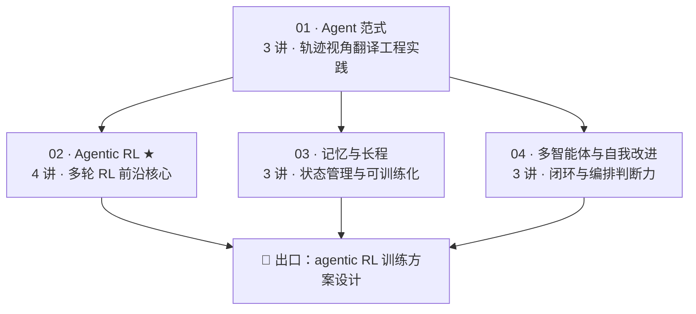

# 02 · Agent 算法专题

> 对应 [ROADMAP Phase 3](../ROADMAP.md)。**四个模块、13 讲，全部可直接阅读**，与 Phase 1 的后训练主线共用同一套「图解正文 + SVG + raw 资料索引」模式。
> 你的工程背景在这里变成优势：本阶段的任务是用**算法视角**重新理解你已经会写的 agent——每条 prompt 技巧都是对轨迹分布的手工塑形，而 agentic RL 把这种塑形变成可训练的目标。

## 课程地图

推荐顺序：01 → 02（主攻，Week 2-3）→ 03 → 04。02 是你的岗位核心差异化。

## 各模块入口

| 模块 | 内容 | 讲次 |
|---|---|---|
| [01 Agent 范式](01-agent-paradigms/README.md) | ReAct 轨迹视角 · 反思规划 · 工具学习 | 3 |
| [02 Agentic RL](02-agentic-rl/README.md) ★ | 四大难题 · 发展线 · GiGPO/ARPO · Search-R1 复现 | 4 |
| [03 记忆与长程](03-memory-and-tools/README.md) | 记忆四分法 · MemGPT · Context Engineering | 3 |
| [04 多智能体与自我改进](04-multi-agent/README.md) | 自我改进闭环 · 编排模式 · 训练vs编排 | 3 |

## 与实践线的对应

| 实践 | 在哪个讲次启动 |
|---|---|
| P5 Search-R1 风格多轮工具 RL | 02 模块第 4 讲 |

## 阶段里程碑

能独立设计一份 agentic RL 训练方案（环境与数据来源、reward 定义、算法选择、评估方案、3 个已知风险），并用 [03-train-vs-orchestrate 的决策树](04-multi-agent/03-train-vs-orchestrate/index.md) 论证「哪里该训练、哪里该编排」——这是面试和实战都能直接用的能力。
