# KNOWLEDGE GRAPH · 知识图谱

> 本文件由 `build_graph.py` 自动生成，请勿手改；改 `nodes.jsonl` / `edges.jsonl` 后重跑脚本。

**进度**：🟢 learned 8 · 🟡 learning 0 · ⚪ todo 52 · 共 60 节点 / 73 边

| 领域 | 节点 | 🟢 learned | 🟡 learning | ⚪ todo |
|---|---|---|---|---|
| 地基（RL 与数学） | 7 | 0 | 0 | 7 |
| SFT 与数据 | 4 | 0 | 0 | 4 |
| 偏好对齐（RLHF/DPO） | 7 | 0 | 0 | 7 |
| 奖励模型 | 5 | 0 | 0 | 5 |
| LLM 强化学习 | 8 | 0 | 0 | 8 |
| 推理模型 | 8 | 2 | 0 | 6 |
| Agent 范式 | 6 | 6 | 0 | 0 |
| Agentic RL | 8 | 0 | 0 | 8 |
| 记忆与长程 | 2 | 0 | 0 | 2 |
| 多智能体与自我改进 | 5 | 0 | 0 | 5 |

## 学习顺序（领域为主线，领域内按先修分层）

按领域顺序往下学；同波次内概念/算法在前、论文在后，可按兴趣穿插。

**—— 地基（RL 与数学） ——**

1. ⚪ **优势函数 / Baseline** `concept` — A = Q - V，减方差的核心技巧；GAE 是其带偏差-方差权衡的估计器
2. ⚪ **数学基础补丁** `concept` — 期望与采样、softmax/温度、熵与交叉熵、梯度/log/sigmoid：读后训练论文的最小数学集
3. ⚪ **TRPO** `method` — PPO 前身：信任域约束的二阶解法，理解「为什么要约束更新」
4. ⚪ **KL 散度** `concept` — 约束当前策略不偏离参考策略的核心工具；k3 估计器；前向/反向 KL 的取舍
5. ⚪ **MDP** `concept` — 马尔可夫决策过程：state/action/reward/transition，一切 RL 的形式化基础
6. ⚪ **策略梯度 / REINFORCE** `concept` — 直接对期望回报求梯度；方差大是核心痛点
7. ⚪ **PPO** `method` — 近端策略优化：clipped surrogate 约束策略更新步长，LLM RL 的基石算法
**—— SFT 与数据 ——**

8. ⚪ **合成数据** `concept` — 模型生成训练数据：self-instruct → 蒸馏 → 自举，现代后训练的数据主粮
9. ⚪ **指令微调** `concept` — 用 (指令,回答) 数据做监督微调，后训练的起点
10. ⚪ **LoRA** `method` — 低秩适配：冻结权重学增量矩阵，PEFT 事实标准
11. ⚪ **LLaMA-Factory** `framework` — 一站式 SFT/对齐工具链，P1 快速通道
**—— 偏好对齐（RLHF/DPO） ——**

12. ⚪ **Bradley-Terry 模型** `concept` — 偏好概率建模：P(A>B)=σ(rA-rB)，RM 和 DPO 共同的数学基座
13. ⚪ **RLAIF / Constitutional AI** `concept` — 用原则+AI 反馈替代人类标注偏好
14. ⚪ **RLHF 三阶段** `concept` — SFT → RM → PPO 的经典范式，行为对齐人类偏好
15. ⚪ **Constitutional AI / RLAIF** `paper` — AI 反馈替代人类偏好 (2212.08073)
16. ⚪ **DPO: Direct Preference Optimization** `paper` — 偏好对齐的免 RM 路线 (2305.18290)
17. ⚪ **InstructGPT: Training LMs to follow instructions with human feedback** `paper` — RLHF 三阶段奠基之作 (2203.02155)
18. ⚪ **DPO** `method` — 直接偏好优化：跳过显式 RM，在偏好对上闭式优化，必须有隐式 KL 约束
**—— 奖励模型 ——**

19. ⚪ **Reward Hacking** `concept` — RM 分数涨而真实质量跌的过度优化现象，一切奖励设计的达摩克利斯之剑
20. ⚪ **奖励模型 RM** `concept` — 从偏好数据学的打分器，RLHF 的上限所在
21. ⚪ **过程奖励模型 PRM** `concept` — 逐步骤打分 vs ORM 只看结果；best-of-N、树搜索、step-level RL 的基础
22. ⚪ **Let's Verify Step by Step** `paper` — PRM 胜 ORM 的判决性工作 (2305.20050)
23. ⚪ **Math-Shepherd** `paper` — MC rollout 自动标注过程奖励 (2312.08935)
**—— LLM 强化学习 ——**

24. ⚪ **RLVR 可验证奖励** `concept` — 用答案匹配/单元测试等可验证信号做奖励，推理 RL 的点火器
25. ⚪ **GRPO** `method` — 组相对策略优化：采样一组、组内归一化作 advantage、去掉 critic
26. ⚪ **OpenRLHF** `framework` — 另一主流开源 RLHF 框架 (2405.11143)
27. ⚪ **TRL (Hugging Face)** `framework` — SFT/DPO/PPO/GRPO 全家桶，上手最友好
28. ⚪ **verl (HybridFlow)** `framework` — rollout/训练分离架构，agentic RL 事实标准 (2409.19256)
29. ⚪ **DAPO** `paper` — clip-higher/动态采样/token 级 loss (2503.14476)
30. ⚪ **DeepSeekMath (GRPO)** `paper` — 提出 GRPO (2402.03300)
31. ⚪ **Dr. GRPO** `paper` — 修正 GRPO 的长度与标准差偏差 (2503.20783)
**—— 推理模型 ——**

32. ⚪ **Test-Time Scaling** `concept` — 推理时花更多算力换更好答案：BoN/beam/MCTS/budget forcing
33. 🟢 **思维链 CoT** `concept` — 生成中间推理步骤提升答案质量；推理模型的输出形态
34. ⚪ **推理蒸馏** `concept` — 用强模型的推理轨迹训小模型：便宜、快速，但上限受限
35. ⚪ **DeepSeek-R1** `paper` — 纯 RLVR 涌现推理行为 + 完整训练管线 + 蒸馏 (2501.12948)
36. ⚪ **Kimi k1.5** `paper` — long2short、部分 rollout 等推理 RL 工程技巧 (2501.12599)
37. ⚪ **rStar-Math** `paper` — PRM+MCTS+自举的搜索式推理 (2501.04519)
38. ⚪ **s1: Simple test-time scaling** `paper` — budget forcing 控制思考长度 (2501.19393)
39. 🟢 **Self-Consistency** `method` — 多样采样+投票：test-time scaling 最初形态
**—— Agent 范式 ——**

40. 🟢 **Agent Loop** `concept` — 感知-推理-行动循环；用 RL 语言即一条多轮 trajectory
41. 🟢 **工具调用** `concept` — 函数调用/搜索/代码执行，扩展动作空间的核心机制
42. 🟢 **规划与搜索** `concept` — ToT/MCTS 式生成-评估-回溯，test-time 的策略改进
43. 🟢 **ReAct** `paper` — 推理+行动交错的 agent 骨架 (2210.03629)
44. 🟢 **Reflexion** `paper` — 语言自我反思记忆 (2303.11366)
45. 🟢 **Tree of Thoughts** `paper` — 推理搜索化 (2305.10601)
**—— Agentic RL ——**

46. ⚪ **Credit Assignment** `concept` — 长轨迹里哪个动作该记功：层级 advantage / 过程奖励 / MC rollout
47. ⚪ **Environment Scaling** `concept` — 任务/环境的自动生成与课程化，agentic RL 的数据问题
48. ⚪ **ARPO** `paper` — 高熵分歧处分支采样的 agentic 探索 (2507.19849)
49. ⚪ **GiGPO** `paper` — group-in-group 层级 advantage 解决 agent credit assignment (2505.10978)
50. ⚪ **Search-R1** `paper` — 搜索引擎即环境的多轮 GRPO，最佳入门复现 (2503.09516)
51. ⚪ **ToolRL** `paper` — 工具学习的奖励设计系统研究 (2504.13958)
52. ⚪ **WebRL** `paper` — self-evolving 课程解决环境数据问题 (2411.02337)
53. ⚪ **多轮 RL** `concept` — agentic RL 的核心：多轮交互、部分可观测、轨迹级优化的特有难题
**—— 记忆与长程 ——**

54. ⚪ **Agent 记忆** `concept` — 工作/情景/语义/程序记忆分层；记忆操作可视为可训练的动作
55. ⚪ **MemGPT** `paper` — OS 式分层记忆自管理 (2310.08560)
**—— 多智能体与自我改进 ——**

56. ⚪ **多智能体系统** `concept` — 编排 vs 训练的分界：通信即 action space
57. ⚪ **自我改进闭环** `concept` — 生成-评估-训练三要素的自我化：self-play / self-reward / self-correct
58. ⚪ **SCoRe** `paper` — 多轮 RL 训出真正的自我修正 (2409.12917)
59. ⚪ **SPIN** `paper` — 自博弈微调：对手是历史的自己 (2401.01335)
60. ⚪ **Self-Rewarding Language Models** `paper` — LLM-as-judge 自评自训闭环 (2401.10020)

## 关系图（mermaid）

```mermaid
graph TD
  subgraph foundations["地基（RL 与数学）"]
    kl-divergence["KL 散度"]
    mdp["MDP"]
    ppo["⚙ PPO"]
    trpo["⚙ TRPO"]
    advantage["优势函数 / Baseline"]
    math-basics["数学基础补丁"]
    policy-gradient["策略梯度 / REINFORCE"]
  end
  subgraph sft-data["SFT 与数据"]
    fw-llamafactory["🛠 LLaMA-Factory"]
    lora["⚙ LoRA"]
    synthetic-data["合成数据"]
    instruction-tuning["指令微调"]
  end
  subgraph preference-alignment["偏好对齐（RLHF/DPO）"]
    bradley-terry["Bradley-Terry 模型"]
    p-cai["📄 Constitutional AI / RLAIF"]
    dpo["⚙ DPO"]
    p-dpo["📄 DPO: Direct Preference Optimization"]
    p-instructgpt["📄 InstructGPT: Training LMs to follow instructions with human feedback"]
    rlaif["RLAIF / Constitutional AI"]
    rlhf["RLHF 三阶段"]
  end
  subgraph reward-models["奖励模型"]
    p-lets-verify["📄 Let's Verify Step by Step"]
    p-math-shepherd["📄 Math-Shepherd"]
    reward-hacking["Reward Hacking"]
    reward-model["奖励模型 RM"]
    prm["过程奖励模型 PRM"]
  end
  subgraph rl-for-llm["LLM 强化学习"]
    p-dapo["📄 DAPO"]
    p-deepseekmath["📄 DeepSeekMath (GRPO)"]
    p-drgrpo["📄 Dr. GRPO"]
    grpo["⚙ GRPO"]
    fw-openrlhf["🛠 OpenRLHF"]
    rlvr["RLVR 可验证奖励"]
    fw-trl["🛠 TRL (Hugging Face)"]
    fw-verl["🛠 verl (HybridFlow)"]
  end
  subgraph reasoning["推理模型"]
    p-r1["📄 DeepSeek-R1"]
    p-kimi-k15["📄 Kimi k1.5"]
    self-consistency["⚙ Self-Consistency"]
    test-time-scaling["Test-Time Scaling"]
    p-rstar-math["📄 rStar-Math"]
    p-s1["📄 s1: Simple test-time scaling"]
    cot["思维链 CoT"]
    distillation["推理蒸馏"]
  end
  subgraph agent-paradigms["Agent 范式"]
    agent-loop["Agent Loop"]
    p-react["📄 ReAct"]
    p-reflexion["📄 Reflexion"]
    p-tot["📄 Tree of Thoughts"]
    tool-use["工具调用"]
    planning-search["规划与搜索"]
  end
  subgraph agentic-rl["Agentic RL"]
    p-arpo["📄 ARPO"]
    credit-assignment["Credit Assignment"]
    environment-scaling["Environment Scaling"]
    p-gigpo["📄 GiGPO"]
    p-search-r1["📄 Search-R1"]
    p-toolrl["📄 ToolRL"]
    p-webrl["📄 WebRL"]
    multi-turn-rl["多轮 RL"]
  end
  subgraph memory-long-horizon["记忆与长程"]
    agent-memory["Agent 记忆"]
    p-memgpt["📄 MemGPT"]
  end
  subgraph multi-agent-self-improve["多智能体与自我改进"]
    p-score["📄 SCoRe"]
    p-spin["📄 SPIN"]
    p-self-rewarding["📄 Self-Rewarding Language Models"]
    multi-agent["多智能体系统"]
    self-improvement["自我改进闭环"]
  end
  classDef learned fill:#d9ead3,stroke:#38761d,color:#1c1c1c;
  classDef learning fill:#fff2cc,stroke:#bf9000,color:#1c1c1c;
  classDef todo fill:#f3f3f3,stroke:#999999,color:#1c1c1c;
  class mdp,math-basics,policy-gradient,advantage,ppo,trpo,kl-divergence,bradley-terry,instruction-tuning,lora,synthetic-data,rlhf,rlaif,dpo,reward-model,prm,reward-hacking,grpo,rlvr,test-time-scaling,distillation,multi-turn-rl,credit-assignment,environment-scaling,agent-memory,multi-agent,self-improvement,p-instructgpt,p-cai,p-dpo,p-lets-verify,p-math-shepherd,p-deepseekmath,p-drgrpo,p-dapo,p-r1,p-kimi-k15,p-s1,p-rstar-math,p-webrl,p-search-r1,p-toolrl,p-gigpo,p-arpo,p-memgpt,p-self-rewarding,p-spin,p-score,fw-trl,fw-verl,fw-openrlhf,fw-llamafactory todo;
  class cot,self-consistency,agent-loop,tool-use,planning-search,p-react,p-reflexion,p-tot learned;
  math-basics -->|先修| mdp
  math-basics -->|先修| policy-gradient
  math-basics -->|先修| kl-divergence
  math-basics -->|先修| bradley-terry
  mdp -->|先修| policy-gradient
  policy-gradient -->|先修| ppo
  advantage -->|先修| ppo
  kl-divergence -->|先修| ppo
  ppo ==>|扩展| trpo
  instruction-tuning -->|先修| rlhf
  bradley-terry -->|先修| reward-model
  bradley-terry -->|先修| dpo
  reward-model -->|先修| rlhf
  ppo -->|先修| grpo
  kl-divergence -->|先修| grpo
  grpo ---|对比| ppo
  dpo ---|对比| rlhf
  tool-use -->|先修| multi-turn-rl
  agent-loop -->|先修| multi-turn-rl
  credit-assignment -->|先修| multi-turn-rl
  cot -->|先修| self-consistency
  cot -.->|应用| p-react
  synthetic-data -.->|应用| instruction-tuning
  lora -.->|应用| instruction-tuning
  prm -.->|应用| test-time-scaling
  self-consistency ---|相关| test-time-scaling
  rlvr ---|相关| test-time-scaling
  rlvr ---|相关| reward-model
  reward-hacking ---|相关| reward-model
  reward-hacking ---|相关| rlvr
  multi-agent ---|相关| self-improvement
  environment-scaling ---|相关| multi-turn-rl
  agent-memory ---|相关| multi-turn-rl
  p-instructgpt -.->|提出| rlhf
  p-instructgpt -.->|提出| reward-model
  p-cai -.->|提出| rlaif
  p-dpo -.->|提出| dpo
  p-lets-verify -.->|提出| prm
  p-math-shepherd ==>|扩展| prm
  p-deepseekmath -.->|提出| grpo
  p-drgrpo ==>|扩展| grpo
  p-dapo ==>|扩展| grpo
  p-r1 -.->|提出| rlvr
  p-r1 -.->|应用| distillation
  p-r1 ---|对比| p-kimi-k15
  p-kimi-k15 -.->|应用| rlvr
  p-s1 ==>|扩展| test-time-scaling
  p-rstar-math ==>|扩展| prm
  p-react -.->|提出| agent-loop
  p-reflexion ==>|扩展| p-react
  p-tot -.->|提出| planning-search
  p-webrl -.->|提出| environment-scaling
  p-webrl -.->|应用| multi-turn-rl
  multi-turn-rl -.->|应用| p-search-r1
  rlvr -.->|应用| p-search-r1
  grpo -.->|应用| p-search-r1
  rlvr -.->|应用| p-toolrl
  multi-turn-rl -.->|应用| p-toolrl
  credit-assignment -.->|应用| p-gigpo
  multi-turn-rl -.->|应用| p-gigpo
  credit-assignment -.->|应用| p-arpo
  grpo -.->|应用| p-arpo
  p-memgpt -.->|提出| agent-memory
  p-self-rewarding -.->|提出| self-improvement
  p-spin ==>|扩展| self-improvement
  p-score ==>|扩展| self-improvement
  fw-verl -.->|实现| grpo
  fw-verl -.->|实现| ppo
  fw-trl -.->|实现| dpo
  fw-trl -.->|实现| ppo
  fw-openrlhf -.->|实现| ppo
  fw-llamafactory -.->|实现| instruction-tuning
  fw-llamafactory -.->|实现| lora
```

## 图例

节点：⚙ 算法 · 📄 论文 · 🛠 框架 ·（无前缀）概念；颜色：绿=learned，黄=learning，灰=todo。

边：`先修`（prereq_of，决定学习顺序）· `提出`（论文→概念/算法）· `扩展` · `应用` · `对比` · `实现`（框架→算法）· `相关`。
